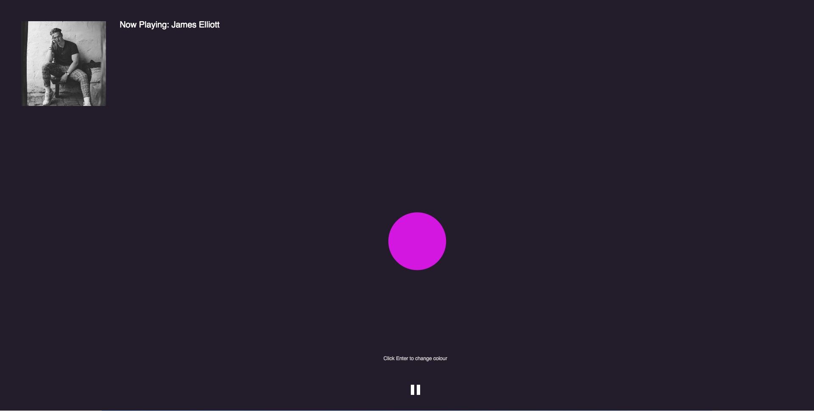
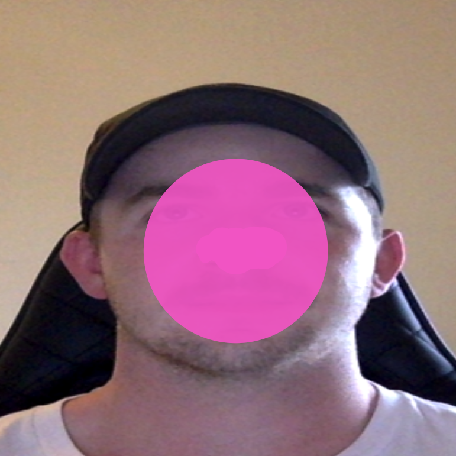

# Week 10 

### Project Progress: 
Since last week I have made some progress and also adjustments to my goals. I have now incorporated the [ml5 Posenet](https://ml5js.org/reference/api-PoseNet/ "ml5 Posenet") library for webcam facial recognition which is now playing a role in determining the movements of the visualiser, I have also began to add some interface and style elements to the sketch. Although I have made the decision to move away from working with 3D objects. I feel that I am not quite up the level where I could confidently incorporate all the interactive functions (such as the Posenet) as well as the 3D objects with in the time frame, and I have deemed the interactive elements more essential to the overall system, therefore I am going to focus on these elements in order to get the best proof of concept possible.

##### Current Sketch Interface:

##### Posenet Example:
Example of how the the balls movement is working of the nose position based on webcam facial tracking via [ml5 Posenet](https://ml5js.org/reference/api-PoseNet/ "ml5 Posenet").

