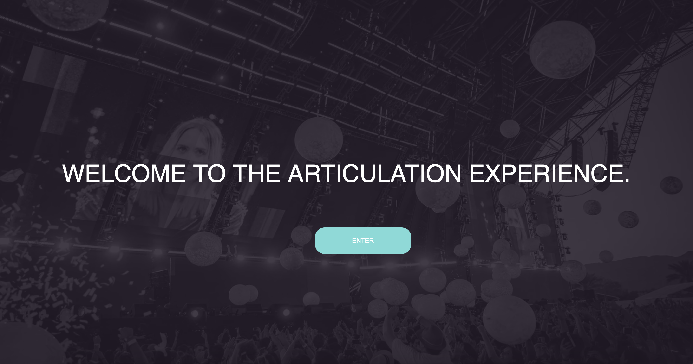
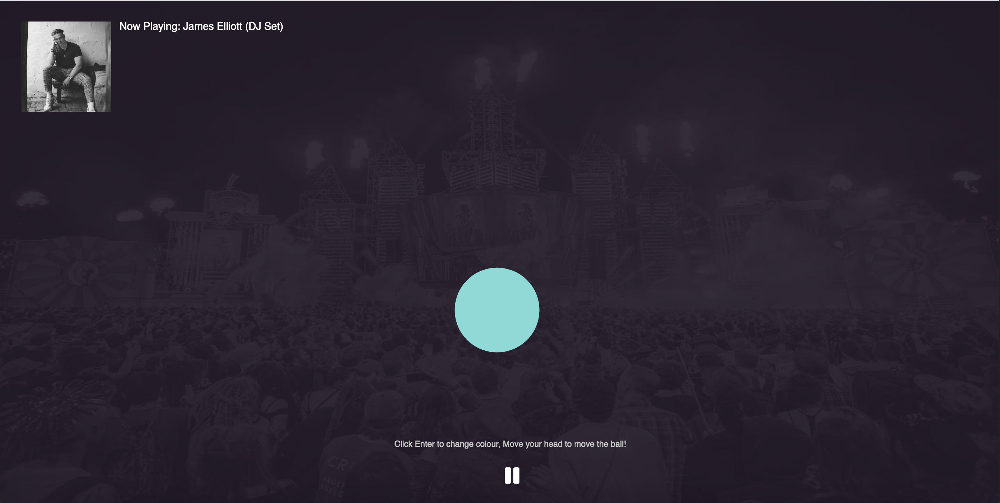

# Week 11

### Summary:
In this week's class we got the chance to have another feedback session with Karen and Andy, along with some discussion with other students in the class. As we're nearing the end of the class these feedback sessions are becoming more and more valuable as we begin to refine, polish and fix issues that have continued to hinder our progress. I found the feedback which I received very valuable, the comments and function, interface and code specific segments gave me a lot to work with and think about coming into our last week.

##### Week 11 WIP Sketch:
[Articulation Week 11](https://connor-mcnamara.github.io/Slave-to-the-algorithm/SketchTest/ "Articulation Week 11")

### Project Update:
Since Last week I have made some soild progess within my project sketch. I have managed to address a lot of the problems which I outlined in my week 9 Milestone review. Some of this advancements include, adding a landing page with syled elements, intergration of motion detection, updated working buttons and interface and user drvien fucntinos such as key presses.

#### Project Screen Captures:

##### Landing Page:

##### Visualisation:

### Project Feedback:

**Karen**
* Explore variation of the visualiser potentially thorugh functions such as (line(x, y, prevX, prevY);).
* Center buttons with (button.position(width/2 - button.width/2, y);)

 **Andy**
 * Experiment with typography/colour... fonts? maybemaybe use an icon (or add a tiny UI) so that some elements are hidden during the experience.
 * Bring the user's experience to the foreground (get the bubbles as big as possible, punch out the effect). 
 * Maybe bubbles change colour based on less obvious variables (rather than adding a control). 
 * Experiment with colours that are less muted. 
 * UI icons can swap with a if/then or while function 
