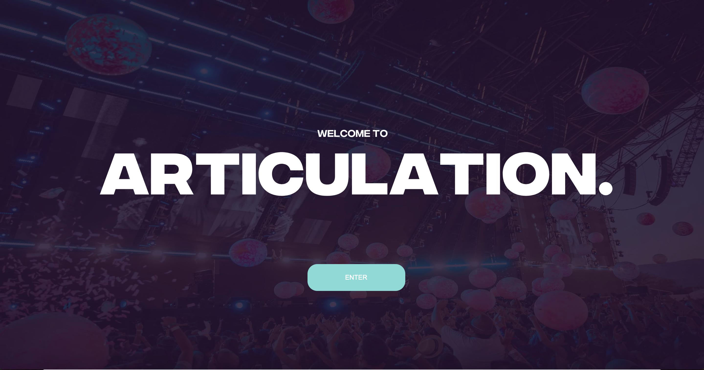
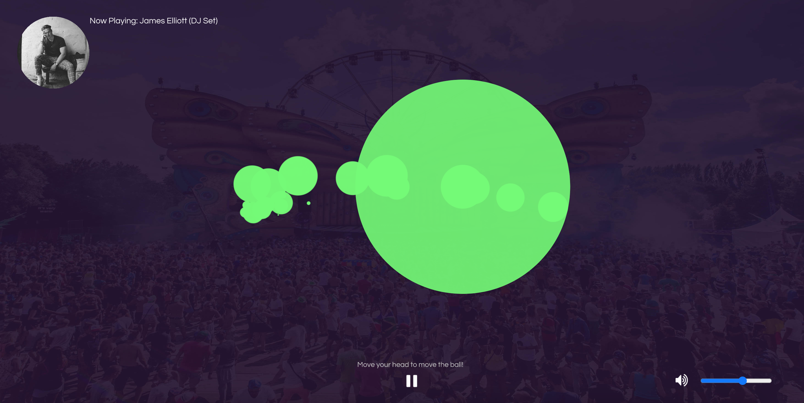
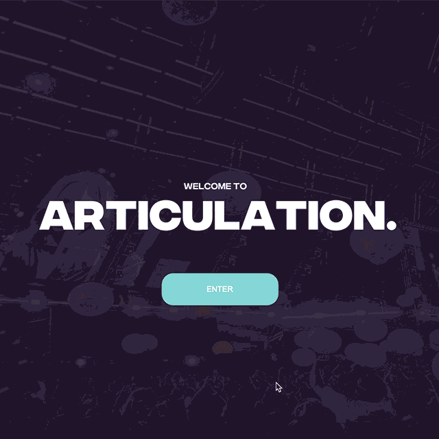

:arrow_left: [PREVIOUS PAGE](https://github.com/connor-mcnamara/Slave-to-the-algorithm/tree/master/Week%2011 "PREVIOUS PAGE") | [MENU](https://github.com/connor-mcnamara/Slave-to-the-algorithm/blob/master/README.md "MENU")  
# Week 12
**Finished Project Link:** [The Articulation Experience](https://connor-mcnamara.github.io/Slave-to-the-algorithm/Articulation_/ "The Articulation Experience")\
Finished Project Code: [Code Here](https://github.com/connor-mcnamara/Slave-to-the-algorithm/tree/master/Articulation_ "Code Here")

### Major changes from last week's feedback:

Last when I received some valuable feedback for Karen, Andy and other students in our class leading into our presentation I took all these things in to consideration and made some adjustments according. Notably, I loaded my own selected fonts in replacing the defaults, added and adjusted UI elements, made the background images more vibrant to reduce dullness, increased bubble size and also made the colour of the bubbles change automatically.

#### Screen captures of 2 pages in the final sketch:

#### Articuation GIF:

## Reflective Statement:
Coming into this class I had very minimal experience with programming and coding, that in a sense was why I chose Slave to the Algorithm, to explore new potentials and challenge myself as a designer. To be honest, at times throughout this semester I definitely underestimated the difficulty and time involved with producing solutions with the coding environment. This did lead to circumstances where I had to evaluate with my skill level, whether or not the ideas in my head possible within the timeframe, often leading to me having to pivot my ideas accordingly.

Although in saying that, when I did spend the time indulging in learning and experimenting with code, it led to me becoming more and more interested in the exploring and understanding the possibilities of code. This studio has definitely opened my eyes to the potential code has to enhance design and open up new doors and opportunity, going forward with my practice I will definitely be more open-minded to going beyond the Adobe Suite to bring ideas to life.

Looking back on the semester we've had; I'm becoming more and more grateful that I chose to jump out of my comfort zone and chose Slave to Algorithm. Not only did Karen and Andy adjust extremely well to the circumstances to provide us when an engaging and exciting experience online, but I believe that the overall approach and thinking encouraged in Slave to the Algorithm is like no other that I have experienced in this course. As designers I think we often get caught up in the final outcomes which we are trying to produce and often neglect the valuable process. I think the exercises, activities, ongoing discussion and overall open environment of Slave to The Algorithm has helped me immensely in taking time to invest in exploration and each step of the process. I am most grateful for this as I believe this way of thinking and approaching tasks which I have developed through this studio is even more valuable than the specific skills that we have learnt. Going forward I hope to continue to work of sorts of projects in the way in which we have in Slave to the Algorithm.
