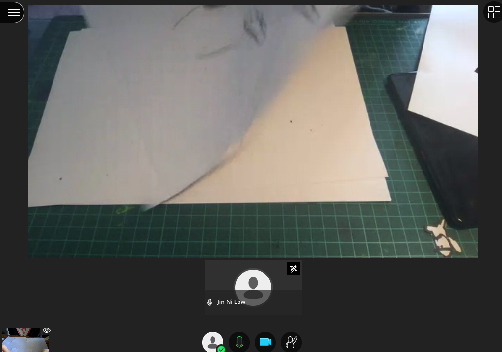
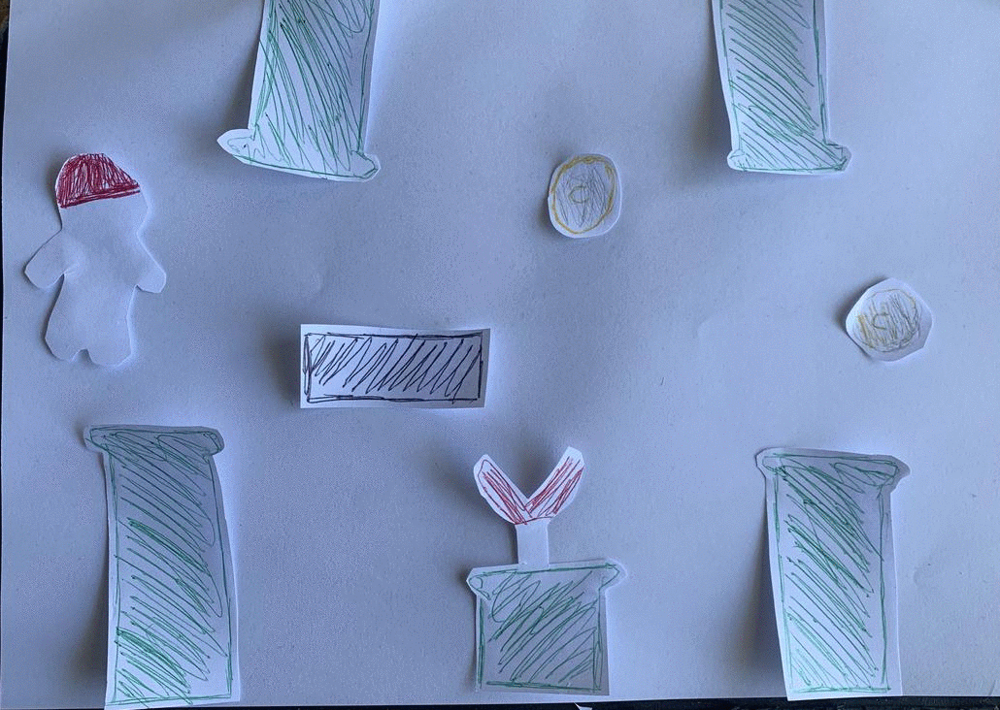

:arrow_left: [PREVIOUS PAGE](https://github.com/connor-mcnamara/Slave-to-the-algorithm/tree/master/Week%205 "PREVIOUS PAGE") | [MENU](https://github.com/connor-mcnamara/Slave-to-the-algorithm/blob/master/README.md "MENU")  | [NEXT PAGE](https://github.com/connor-mcnamara/Slave-to-the-algorithm/tree/master/week%207 "NEXT PAGE") :arrow_right:
# Week 6 

### Project categorisation:
At the begining of the class we mapped out are projects in a spreadsheet in order to determine which student projects had similarites. When split into groups based on these similarites, this gave us a chance to chat with other students that had some sort of crossover whether it be big or small in our projects which was beneficial in helping determine some appriate tools and methods to use going forward.

### Paper prototype exercise:
The hands on exercise this week involved splitting into small groups and picking a 2d video game to use as a basis for constructing a paper prototype. 
Our group chose to pick Mario.

#### Group Setting: 
During the exercise, in our collaborate ultra groups we all turns our cameras on while attempting to contruct the paper prototypes, it was interesting to see how each invdivudals approach varyied slightily.

#### My Paper Prototype:
Below is my paper prototype in which I have attempted to highlight the key elements of functionality within the game.

### Processing with Sound in p5.js:
In today's class we also completed another workshop, this time looking at sound specifically in p5.js. We looed at how to make elements move based on a sound we we had loaded in using the p5.Amplitude function.

### Project Udapte: 
Since our pitches last week, I've decided that going forward with my project I am going to narrow my scope and focus on one particular generative concept from my broader speculative festival concept. At this stage I am planning on to focus on 'The Walking Wall' concept proposed in my pitch which revolved around the idea of art being generated by gps data of the participants. Going forward I am looking to create a system which uses the input of user data to generate unique art displays and merchandise for each participant based on the unique travel patterns they produce. As this festival won't actually be a held event, the outcome which I am aiming to produce will be in the form of a proof of concept. At this stage I am planning on to focus on 'The Walking Wall' concept proposed in my pitch which revovled around the idea of art being generated by gps data of the particapnts. Going forward I am looking to create a system which uses the input of user data to generate unique art displays and merchandise for each particpant based on the unique travel patterns they produce. As this festvial won't actually be a held event, the outcome which I am aiming to produce will be in the form of a proof of concept. 

#### Project to do list:
* Decide what specifc user data I want to track. 
* Find out I am going track this data.
* Figure out how to turn GPX data into processable data.
* Decide on what form the outcomes of the processed data will be.

