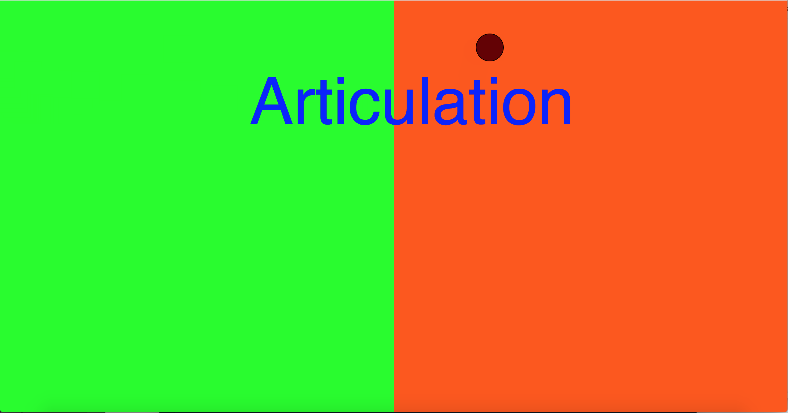
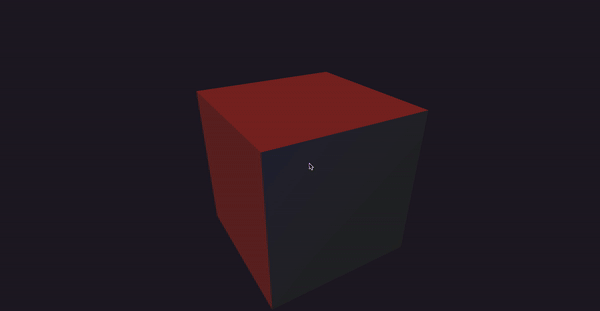
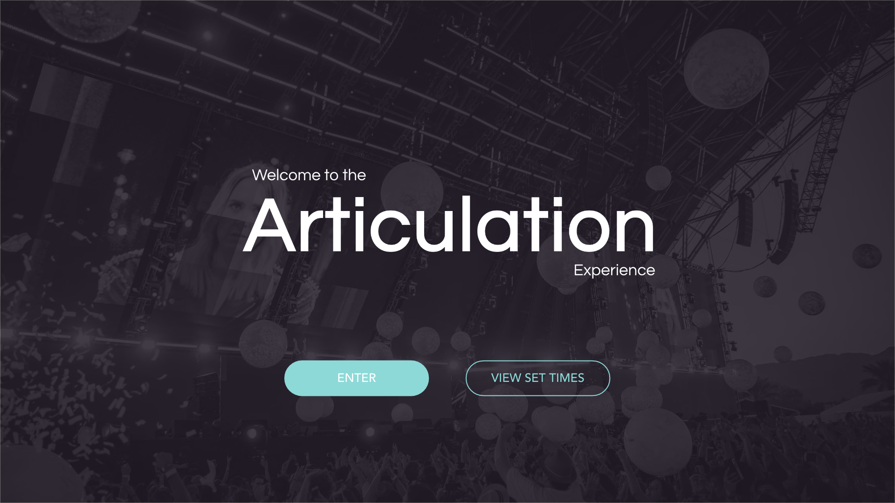
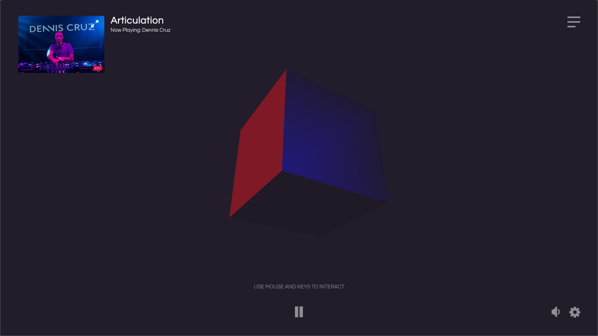

# Week 9

### Summary:
This week we started off by having a Milestone Review which has another opportunity for us all to show where we are currently up too. While the sketch which I presented is still in the very early stages of development I am confident now that I am starting to find my feet a bit more. I am beginning to feel as though I've found a bit my clarity to not only what I am doing with my project but also with my knowledge and understanding of p5.js. I am starting to get the hang of things p5.js finding simple functions a lot easier which is making quite exciting to see how far I can push this project.

### p5.js Workshop:
In this week's workshop we looked in added multiple canvas' to a sketch. This is something that could potentially be useful within my project. 

##### Multiple canvas sketch from class:


### Project Progress:
Currently with in my P5.js sketch I have managed to load a song and have the beat/volume of the song determine the shape of the Cube whist it rotates. 

##### Current Sketch:


##### Sketch Code: 

```
var song; 
var analyzer;
function preload() {
 song = loadSound ('data/Bicep-Glue.mp3'); //Load song
}

function setup() {
  createCanvas (displayWidth, displayHeight, WEBGL); // sets full display canvas for 3d Shapes
  background(0);
  analyzer = new p5.Amplitude();
  analyzer.setInput(song);

}

function draw() {
  background(35, 28, 41);
  var volume = analyzer.getLevel();
  volume*=1000;
  ambientLight(50);
  directionalLight(255, 0, 0, 0.25, 0.25, 0);
  pointLight(0, 0, 255, 0, 0 , 250);
  rotateX(frameCount * 0.01); //Sets spinning speed 
  rotateY(frameCount * 0.01);
  box(200);
  box(volume,volume);// sets box size to be dependent on volume 
  fill(200,200,200);
  noStroke();

}


function mousePressed() {
  if (song.isPlaying()) {
     song.stop(); // if the song is playing, stop it
     song.noLoop();
  }
  else {
    song.loop();
    song.play(); 
  }
}
```

### Next Steps with project:
Going forward, my next big steps will be focused around incorporating user interaction into the sketch and adding an interface to the environment. In order to incorporate more user interactions I plan start investigating and exploring integrating ML5.js PoseNet in my sketch to allow user facial and arm movements have an impact on how the visualiser moves. I would also like to incorporate a mouse or keyboard driven function which has an effect to either the shape or colour of the visualiser.

For the interface of the portal, I plan to use my mock ups as a basis for creating a functional user interface to compliment the visualisation. In order to do so I plan on utilising HTML and CSS to develop elements such as buttons and a style guide.

Some other functions I need to work on to achieve full functionality within the system are a load and play video function for the DJ Video window, IF Statements and desired actions for all the buttons and parameters for input data from key presses, mouse clicks and motion tracked plot points.

##### Interface Mock ups:



