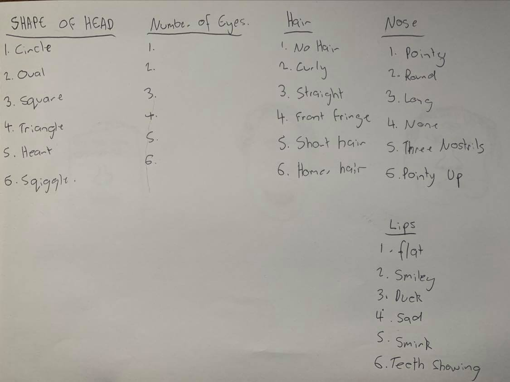
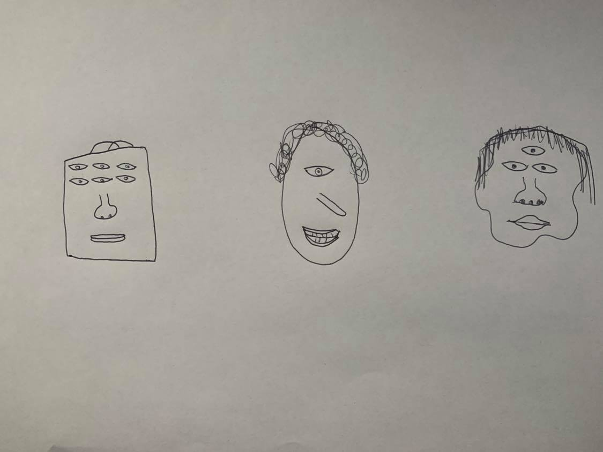

[MENU](https://github.com/connor-mcnamara/Slave-to-the-algorithm/blob/master/README.md "MENU") [NEXT PAGE](https://github.com/connor-mcnamara/Slave-to-the-algorithm/tree/master/week%201 "NEXT PAGE"
)
## Summary:
Today was the beginning of our studio sessions, its exciting and a bit bit scary at the same time, I knew this studio was going to be very different to anything that I had been enrolled in before, so today really felt like the start of a new chapter you could say. After listening to Karen explain what we are going to be covering in this coarse, and seeing some examples of practioners and work in the field, I am beginning to understand what exactly it is we'll be looking into, and I must say, I'm quite intriugued, the whole idea of generative art and algorthimic systems is a concept I havne't really explored though it seems like the could be a lot of cool potentially involved. 

## Generative Design System Exercise:

### Generative Design System

This is the system of varaibles we created in groups for 5 rolls of a 6 sided dice.

### Results 
Here are 3 different outcomes based of our system, the results of quite varied but its a massive surprise considering considering the amount of variation in the variables.

