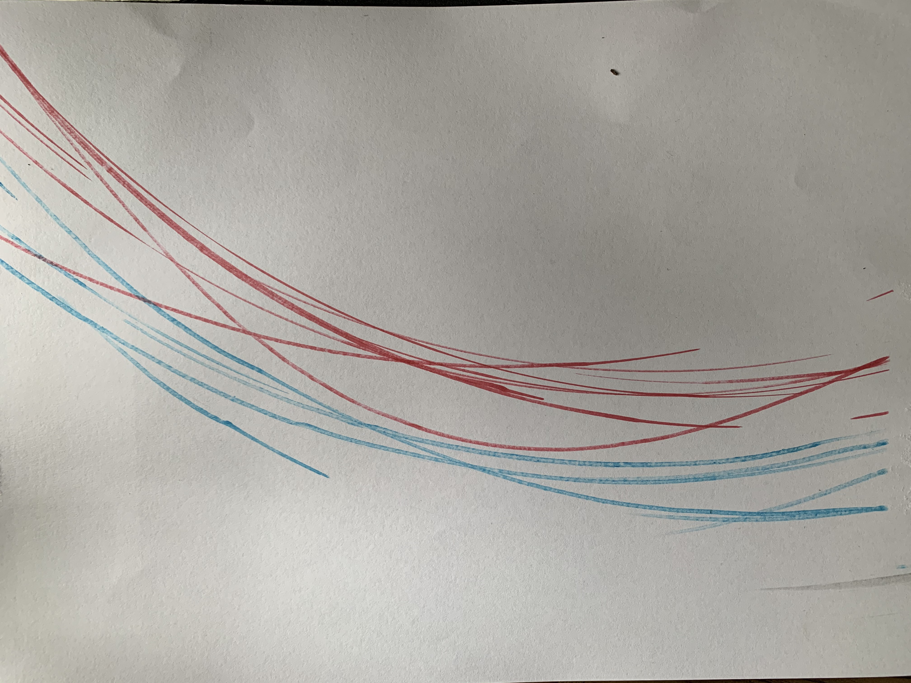

# Week 3

## Summary:
In this session we looked at some work from artists within the realm of rules based design, along with some great example of Non-Human design and drawing machines which lead us into our hands on activity of creating a Non-Human drawing machine of our own with items around our houses. In the afternoon we broke out into groups and completely a INPUTS, PROCESSES & OUTPUTS activity which focused on discissing potetial processes. 

## Non-Human Drawing Machine Examples:

### Notable Artists:

## Non-Human Drawing Machine Activity:

### Pre Planning 
The exercise began with sketching ideas for potential drawing machines that we could make utilising objects around our house, my sketch consisted of a makrer tapeed to a bike tyre, the concept was that when the ture was spun on the the floor in would autonomously draw on a piece of paper postioned udnerneath.

### Set up 
Below is a picture of the set up I constructed based on the plan I drew up.

### Drawing Wheel in action 
The Gif below shows the machine working upon spinning.

### Outcome 
Pictured is the otucome which came from spinning the wheel, as you can see it generated a a series of rough lines which varied depending on the uncotrolled variable of movement from the tyre.

### Surprise Outcome
I actually found the outcome the pen left of the floor (sorry mum) more interesting that the planned outcome, which shows that you can plan everything but sometimes happy accidents can come from unplanned events. 

## Inputs, Proceses, Outputs Discussion:
In the afternoon we broke out into groups and went through a list of INPUTS and OUTPUTS in order to try and think of processes which could take the INPUT to the desired OUTPUT. This exercise lead to a lot of interesting and at times crazy discussion about potentials but overall was great in helping get us in a creative and functional thinking mindset.
