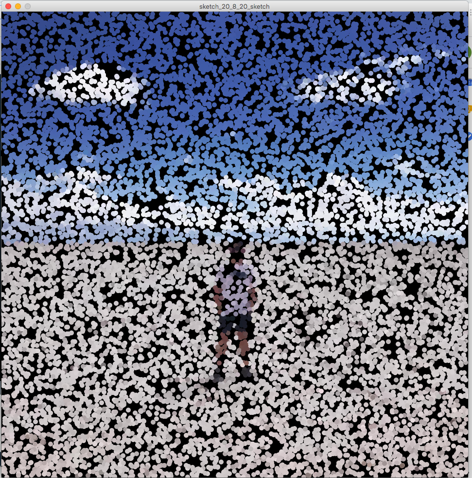
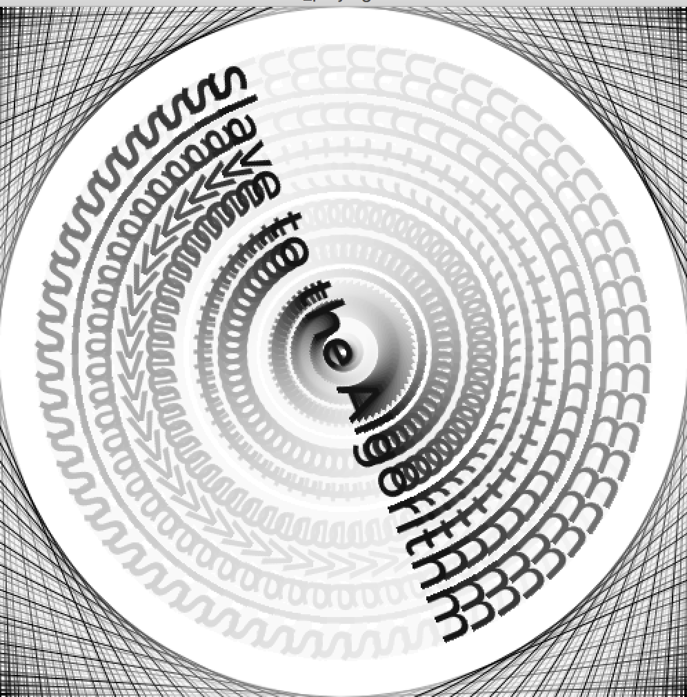

# Week 4 

## Summary:
During this weeks class we continued to explore different possibilities within processing expanding our skills in the specific areas of playing with type and images and some of the interactions that we can create with these. Playing around with different functions such as the 'random function and 'pointillism' sketch really helped open my eyes to the possibilites that could come from coding, I knew code was a powerful tool, but actually playing around with different functions really helped spark my thought process in relation to the possibilites of my generative outcome. 

## Processing Hunting and Gathering example:
While exporing [OpenProcessing](https://www.openprocessing.org/ "OpenProcessing") there where many cool sketches which I stumbled across, a lot of them being quite Mesmerising. This sketch 'Glowing anemone' sketch by CHE YU WU was one that caught my eye in particular, I love the way the multiple coloured elments interact especially upon muse movements. 

Sketch Link: https://www.openprocessing.org/sketch/889053#

## Processing Workshop:

#### Pointillism self drawing sketch based on photo of myself:

#### Spinning Typography sketch which leaves a trail:

## Project Pitch Progress:

While it’s great that the possibilities are nearly endless for our generative project it also makes it a little bit challenging to pick one direction to start perusing as with every activity we do I begin to think of more and more paths I would love to pursue. At the moment my idea revolves around some I love, that being music festivals. I've been exploring the idea of pitching a Music and Arts festival which incorporates some form of generative art displays as I think this would be such an amazing idea. I know this idea is quite speculative, but it’s not in every class that you are actually given the room to explore such large ideas freely therefore I want to take advantage of this opportunity, obviously going forward this idea may need to be brought back to reality a bit to actually bring it to fruition, but for now I'm thinking quite large and speculatively.

### Generative Art Examples:
As the concept I'm playing with primarily revoles around creativing some form of live art display, I spend some time researching some pieces which fit into this field. One display which I found really cool and thought could work/relate directly to a festival environment was [Voice Array](https://www.lozano-hemmer.com/voice_array.php "Voice Array") by [Rafael Lozano-Hemmer](https://www.lozano-hemmer.com/bio.php "Rafael Lozano-Hemmer")a Mexican Media artist working at the intersection of architecture and performance art.

The dispaly works by having a participant speak into an intercom, 'His or her voice is automatically translated into flashes of light and then the unique blinking pattern is stored as a loop in the first light of the array. Each new recording pushes all previous recordings one position down and gradually one can hear the cumulative sound of the 288 previous recordings. The voice that was pushed out of the array can then be heard by itself.'

I thought there could defintely merit to using this sort of technology at a festvial, linking sound to the intensity of a light display. 

#### 'Voice Array' by Rafael Lozano-Hemmer:
[Video of the system in action](https://www.trendhunter.com/trends/voice-array-by-rafael-lozanohemmer "Video of the system in action")

