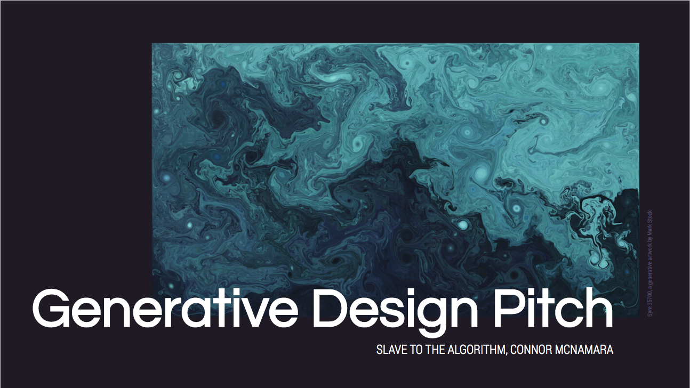

:arrow_left: [PREVIOUS PAGE](https://github.com/connor-mcnamara/Slave-to-the-algorithm/tree/master/week%206 "PREVIOUS PAGE") | [MENU](https://github.com/connor-mcnamara/Slave-to-the-algorithm/blob/master/README.md "MENU")  | [NEXT PAGE](https://github.com/connor-mcnamara/Slave-to-the-algorithm/tree/master/Week%206 "NEXT PAGE") :arrow_right:

# Week 5

### Summary:
The week leading up to the pitch was mostly spent brainstorming idea and trying to refine all the crazy thoughts into potential oppurtunties for this festival which I am specuating about. This weeks class revolves around pitching our Generative ideas to the rest of the class, it was great to see what everyone else in the class had been cultivating over the last few weeks and I quite pleasantly suprised by the diversity of ideas which we saw in the pitches. 

###  Pitch Presentation "Articulation Festival"

#### Pitch link:
[Articulation Link](https://docs.google.com/presentation/d/e/2PACX-1vTX7iR91wN05M9mjJxn5TV2suz5eh8qPJ3lzxB-3-ZtxtbXJWrhRufdbpznjyl7dLwiIkUL25ZFgLem/pub?start=false&loop=false&delayms=3000 "Articulation Link")

### Pitch Feedback 

A majority of the feedback revolved how this idea could be taken forward especially in the current climate we are living in and what potential data could be collected and used from particiapnts at the event. 

Karen emphasised that I should not only focus on what data is possible to collect, but also what data might be most interesting to convert in a display. Michael Lam also mentioned that making the display virtual in some way could be a good way to make it 'COVID Friendly', this is definitely something to consider going forward, I virtual outcome is not only suitable for the current climate but make also be more achievable in the time frame we have.

