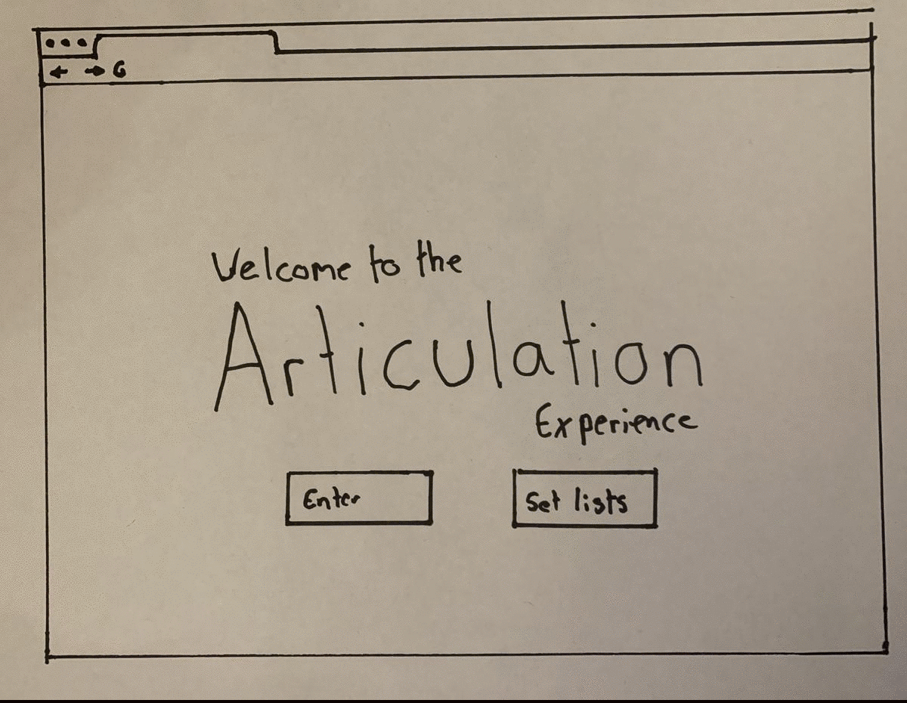

# Week 7

### Summary and Project Update:
Unfortunately I missed this week session, So I missed the in class activities but I did go over the week 7 module on canvas and complete some of the tasks related to our projects as well as having a look and play with the sketch tutorials that where completed in the class. As far as my project is concerned, since last week I have decided to pivot my idea significantly. After doing some more research into the code, libraries and functions that would be needed to take tracked GPX data from an iPhone and use that to generate art, I came to the conclusion that it was going to be a bit outside my scope of ability. Therefore, I have decided to focus on the other element which I pitched, 'The Prism' a digital visualiser. I am also going to be taking on the advice of Michael Lam about potentially making this speculative festival a virtual festival as I think its not only very sutibale for the COVID-19 climate, but I think its also an a lot more achievable outcome for myself.

#### Revised Proposal: 
‘Articulation’ a virtual, interactive music and visualisation environment.

#### Revised Plan: 
Create an online portal to a virtual festival where people can enter and listen to DJ sets which are accompanied by a digital visualiser that changes according to the music playing, mouse movements, key presses and wemcam or camera motion.

### Project Paper protype:


### Project Pseudo Code: 
```
IF “Enter Virtual Festival’ button is clicked THEN
show Visualiser
END IF
IF ‘See Tracklist’ button is clicked THEN
Show tracklist
END IF
```
```VAR song
VAR Analyser
VAR Visualier Shape
```
```FUNCTION preload Song = loadSound “ “
```
```FUNCTION setup Analyser set input song
Video = createCapture(VIDEO) Detected Caputre = Plot points
```
```FUNCTION draw
VAR volume = analyser getLevel
Volume level SETS Visualiser shape size
```
```IF Motion Detected
THEN
Visualiser shape position = Plot point position ELSE
Visualiser Shape (mouseX, MouseY)

FUNCTION mouse click Visualiser Shape colour changes
IF pause button is clicked 
THEN song = stop

