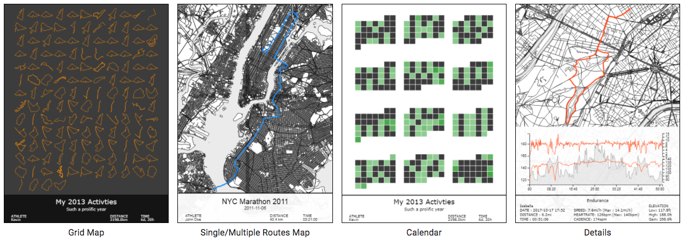

:arrow_left: [PREVIOUS PAGE](https://github.com/connor-mcnamara/Slave-to-the-algorithm/tree/master/week%206 "PREVIOUS PAGE") | [MENU](https://github.com/connor-mcnamara/Slave-to-the-algorithm/blob/master/README.md "MENU")  | [NEXT PAGE](https://github.com/connor-mcnamara/Slave-to-the-algorithm/tree/master/week%208 "NEXT PAGE") :arrow_right:
# Week 7

### Summary and Project Update:
Unfortunately I missed this week session, So I missed the in class activities but I did go over the week 7 module on canvas and complete some of the tasks related to our projects as well as having a look and play with the sketch tutorials that where completed in the class. As far as my project is concerned, since last week I have decided to pivot my idea significantly. After doing some more research into the code, libraries and functions that would be needed to take tracked GPX data from an iPhone and use that to generate art, I came to the conclusion that it was going to be a bit outside my scope of ability. Therefore, I have decided to focus on the other element which I pitched, 'The Prism' a digital visualiser. I am also going to be taking on the advice of Michael Lam about potentially making this speculative festival a virtual festival as I think its not only very sutibale for the COVID-19 climate, but I think its also an a lot more achievable outcome for myself.

#### Revised Proposal: 
‘Articulation’ a virtual, interactive music and visualisation environment.

#### Revised Plan: 
Create an online portal to a virtual festival where people can enter and listen to DJ sets which are accompanied by a digital visualiser that changes according to the music playing, mouse movements, key presses and wemcam or camera motion.

### What have I learnt?
Even know I've decided no to persue GPX data processing through my research I did learn a few things about it and the possibilites of using it. 

* In order to use GPX data you first need to collect it, plot it before you can use the tracked data. 
* The strava running app allows you to export GPX files so it could of been used as a way for users to collect input data.
* The p5.geolaction library could be used for acquiring, watching, calculating, and geofencing user locations in p5.js.

### Notable GPX Data Art Examples: 
In my research I found that there are mutltiple entites such as [Loopie](http://www.loopieroute.com/ "Loopie") and [Cartorion](https://www.cartorion.com/ "Cartorion") working in conjuction with Strava to help people take data from there daily running and turn it into art pieces. More details about these options can be found at [Strava Prints](https://www.strava.com/apps/prints "Strava Prints")

#### Cartorion GPX Art Examples:

