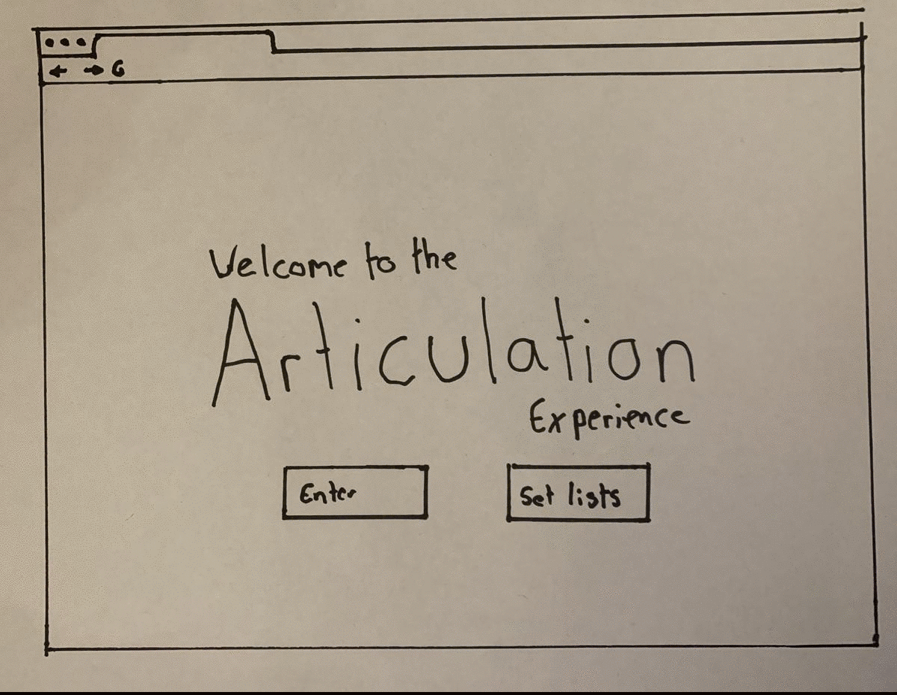

# Week 8 

### Summary:

The class started by going through and having a look and everyone’s different paper prototypes and pseudocode, once again you coud reall see the diverse range of directions people are starting to go in which was exciting. My paper protoype shows the basic concept of how the online visualier I am working towards is going to function, starting with a landing page which then directs to an online environment where there is music and video playing accompanied by on screen visuals. Later in the session we also had another workshop which looked at p5.Speech which was very interesting. 


### Project Paper protype:


### Project Pseudo Code: 
```
IF “Enter Virtual Festival’ button is clicked THEN
show Visualiser
END IF
IF ‘See Tracklist’ button is clicked THEN
Show tracklist
END IF

VAR song
VAR Analyser
VAR Visualier Shape

FUNCTION preload Song = loadSound “ “

FUNCTION setup Analyser set input song
Video = createCapture(VIDEO) Detected Caputre = Plot points

FUNCTION draw
VAR volume = analyser getLevel
Volume level SETS Visualiser shape size

IF Motion Detected
THEN
Visualiser shape position = Plot point position ELSE
Visualiser Shape (mouseX, MouseY)

FUNCTION mouse click Visualiser Shape colour changes
IF pause button is clicked 
THEN song = stop
```

### Class Workshop: 

this week's class 
